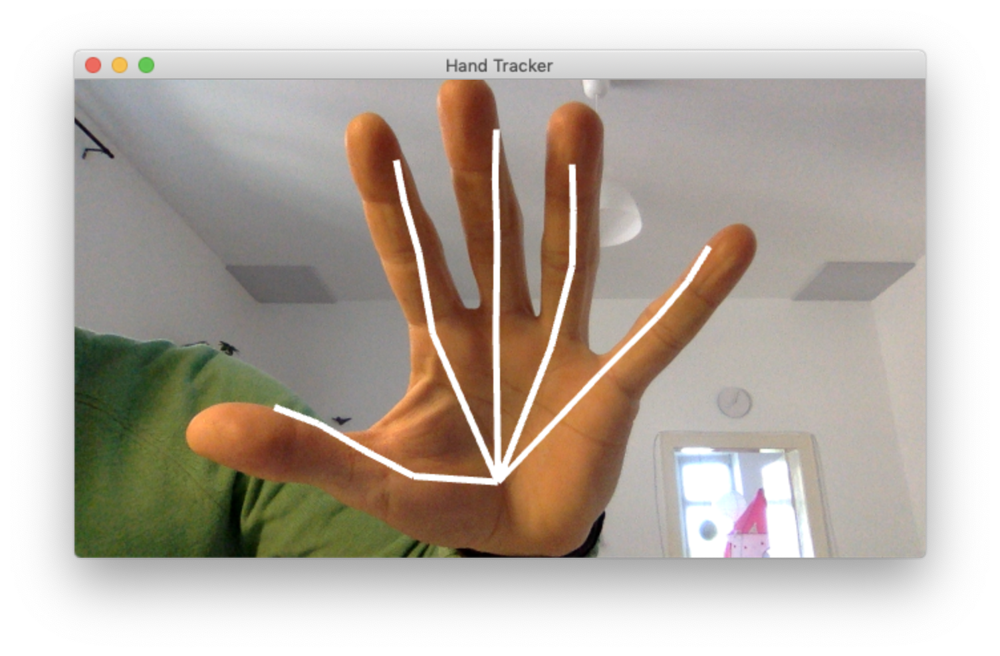

Hand Tracker
============



An ofxTensorFlow2 example using the Google Mediapipe Hand Tracking model as converted to TF2 from the following GitHub repo:

https://github.com/geaxgx/depthai_hand_tracker

The code has been developed by the ZKM | Hertz-Lab as part of the project [»The Intelligent Museum«](https://hertz-gitlab.zkm.de/Hertz-Lab/Research/intelligent-museum/ofxTensorFlow2/-/tree/main#the-intelligent-museum).

Copyright (c) 2021 ZKM | Karlsruhe.  
Copyright (c) 2021 Dan Wilcox.

BSD Simplified License.

For information on usage and redistribution, and for a DISCLAIMER OF ALL
WARRANTIES, see the file, "LICENSE.txt," in this distribution.

Dependencies
------------

* [openFrameworks](https://openframeworks.cc/download/)
* openFrameworks addons:
  - ofxOSC (included with oF)
  - [ofxTensorFlow2](https://github.com/zkmkarlsruhe/ofxTensorFlow2)
* Pre-trained hand tracker model placed in `bin/data`

Installation & Build
--------------------

Overview:

1. Follow the steps in the ofxTensorFlow2 "Installation & Build" section for you platform
2. Download the pre-trained model and place it in `HandTracker/bin/data`
2. Generate the project files for this folder using the OF ProjectGenerator
3. Build for your platform

### Downloading Pre-Trained Model

A version of the pre-trained model converted to TensorFlow2 is provided which you can download as `model_hancktracking.zip` from a public shared link here:

https://cloud.zkm.de/index.php/s/gfWEjyEr9X4gyY6

After unzipping the file, place the SavedModel folder named "model" in `HandTracker/bin/data/`.

To make this quick, a script is provided to download and install the model (requires a Unix shell, curl, and unzip):

```shell
cd HandTracker
./scripts/download_model.sh
```

### Generating Project Files

Project files are not included so you will need to generate the project files for your operating system and development environment using the OF ProjectGenerator which is included with the openFrameworks distribution.

To (re)generate project files for an existing project:

1. Click the "Import" button in the ProjectGenerator
2. Navigate to the project's parent folder ie. "apps/myApps", select the base folder for the example project ie. "HandTracker", and click the Open button
3. Click the "Update" button

If everything went Ok, you should now be able to open the generated project and build/run the example.

### macOS

Open the Xcode project, select the "HandTracker Debug" scheme, and hit "Run".

For a Makefile build, build and run an example on the terminal:

```shell
cd HandTracker
make ReleaseTF2
make RunRelease
```
### Linux

For a Makefile build, build and run an example on the terminal:

```shell
cd HandTracker
make Release
make RunReleaseTF2
```

Usage
-----

The openFrameworks application runs the tracker model using webcam input. The tracked hand output is mapped to several parameters which are normalized and sent out using OSC. Palm and landmark detection thresholds can be adjusted acording to lighting or other background conditions.

### Key Commands

* `+` / `-`: increment/decrement landmark threshold 0 - 1
* `[` / `]`: increment/decrement palm threshold 0 - 1
* `d`: show/hide debug view
* `p`: pause/unpause tracker (saves CPU when not in use)
* `w`: show/hide hand wireframe in non-debug view

### OSC Communication

Sends to:
* address: `localhost` ie. `127.0.0.1`
* port: `9999`

Message specification:

* **/detected status**: detection event
  - status: float, boolean 1 found - 0 lost
* **/pinch value**: relative pinch between thumb and middle fingertips
  - value: float, 0 far - 1 close
* **/spread value**: realtive average distance between finger tip and palm
  - value: float, 0 fist - 1 flat hand

Demos
-----

The demos consist of rapid prototypes built using the following components:

* hand tracker
* sound engine: [Pure Data (Pd)](http://pure-data.info/)
* visual front end: [loaf](http://danomatika.com/code/loaf)

[Pure Data](http://pure-data.info/) is used as a sound engine and mapping running a custom patches which communicate with loaf via OSC. Install Pd "vanilla" from: http://puredata.info/downloads/pure-data

Custom visual front ends are written in Lua for [loaf](http://danomatika.com/code/loaf), a Lua interpreter with bindings for [openFrameworks](http://openframeworks.cc/) which includes a built-in Open Sound Control (OSC) server.

An example of one such system using all three applications (tracker, Pd, & loaf) would be:

```
tracker --OSC--> Pure Data patches <==OSC==> loaf scripts
```

### Usage

To set up a run environment on macOS, download both Pure Data and loaf and place the .apps in the system `/Applications` folder.

To run a loaf project, drag the main Lua script or project folder onto the loaf.app. To run a Pure Data patch, double-click and/or open the main patch file in Pure Data.
