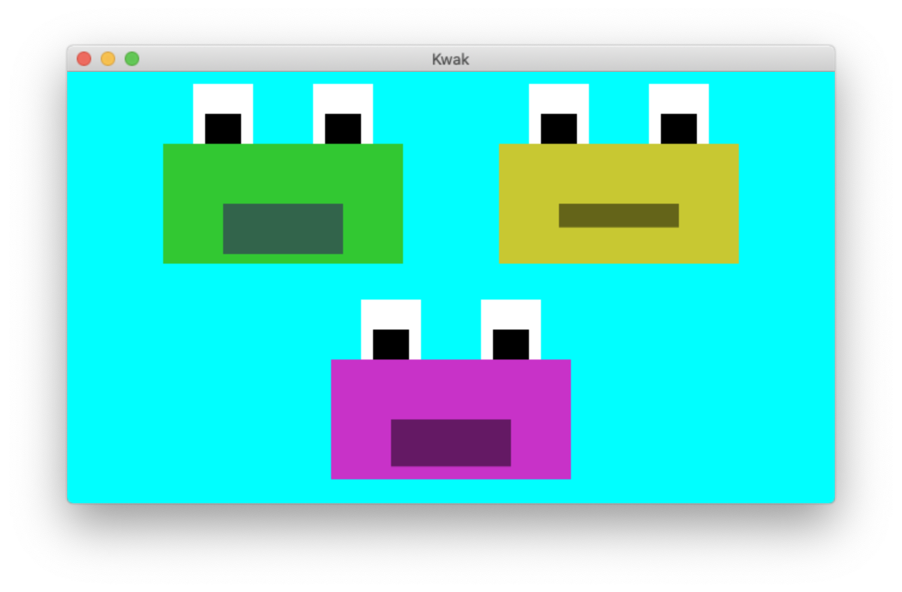

Kwak Demo
==========



Copyright (c) 2021 Dan Wilcox.

Simple virtual character puppetry:
* open & close hand to make frogs croak
* two modes:
  - 0: separate open & close events (green & yellow)
  - 1: variable pitch (purple)

Usage
-----

1. start hand tracker
2. open `pd/kwak.pd` in Pure Data & enable the listen toggle box
3. run `main.lua` in loaf
4. in loaf, toggle modes using spacebar

OSC Communication
-----------------

```
tracker --OSC--> kwak.pd <==OSC==> main.lua
```

tracker:
* send address: "localhost"
* send port: 9999

kwak.pd
* receive port: 9999
* send address: "localhost"
* send port: 8888
* receive messages:
  - **/mode mode**: set front mode
    + mode: float, 0 or 1

main.lua
* receive port: 8888
* send address: "localhost"
* send port: 9999
* receive messages:
  - **/one**: trigger frog one (green)
  - **/two**: trigger frog two (yellow)
  - **/three mouth**: set frog three (purple) mouth height
    + mouth: float, 0 closed - 1 open
